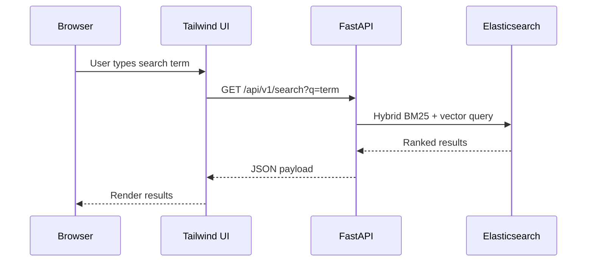

# Argus Reimagined V2

## Overview

A modern educational platform built with a **FastAPI** backend, **Tailwind CSS** powered frontend, and a **local Elasticsearch** hybrid (BM25 + vector) search service.

---

## Docker Compose

```yaml
version: "3.8"
services:
  elasticsearch:
    image: docker.elastic.co/elasticsearch/elasticsearch:8.12.0
    container_name: es
    environment:
      - discovery.type=single-node
      - xpack.security.enabled=false
      - "ES_JAVA_OPTS=-Xms512m -Xmx512m"
    ports:
      - "9200:9200"
    volumes:
      - esdata:/usr/share/elasticsearch/data

  backend:
    build: ./backend
    container_name: backend
    environment:
      - ELASTICSEARCH_URL=http://elasticsearch:9200
    ports:
      - "8000:8000"
    depends_on:
      - elasticsearch
    command: uvicorn app.main:app --host 0.0.0.0 --port 8000

  frontend:
    build: ./frontend
    container_name: frontend
    ports:
      - "3000:80"
    depends_on:
      - backend

volumes:
  esdata:
```

Run the stack with:
```bash
docker compose up -d
```

---

## API Documentation

The FastAPI backend automatically generates OpenAPI docs. Once the services are running, visit:

- Swagger UI: `http://localhost:8000/docs`
- ReDoc: `http://localhost:8000/redoc`

### Search Endpoint

```
GET /api/v1/search?q={query}
```

**Parameters**
- `q` (string, required): Search query.

**Response** (JSON)
```json
{
  "q": "your query",
  "results": [
    {
      "id": "worksheet-1",
      "title": "Planetary Math Worksheet",
      "description": "Practice core math concepts related to planets and space.",
      "type": "worksheet"
    }
    // ... more results
  ]
}
```

---

## Architecture Diagram



---

## Indexing Data

Run the indexing script after the containers are up:
```bash
docker exec -it backend python -m app.scripts.index_data
```

This will create the `argus_knowledge` index (if it does not exist) and populate it with sample documents.

---

## Development

### Backend

```bash
cd backend
python -m venv .venv
source .venv/bin/activate  # on Windows use .venv\Scripts\activate
pip install -r requirements.txt
uvicorn app.main:app --reload
```

### Frontend

```bash
cd frontend
npm install
npm run dev
```

---

## License

MIT License
